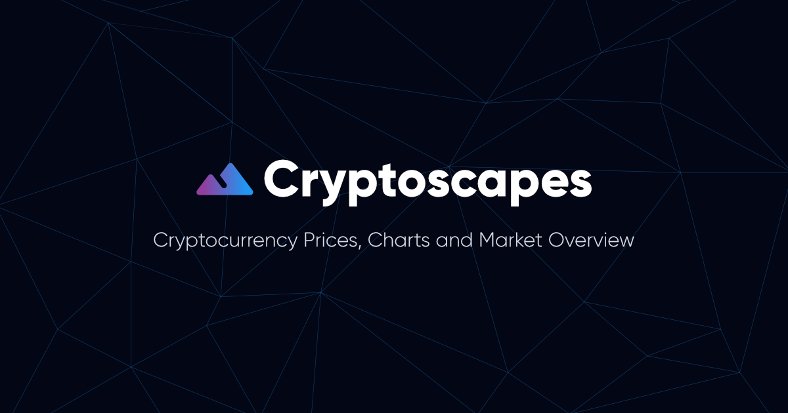

<!-- 

  Visit the website at <a href="https://www.cryptoscapes.org/" target="_blank">cryptoscapes.org</a>

 -->

## ⭐  About this Website
This project started out from a few skills I wanted to learn and practice over my summer break from college, most notably the state management library, [Redux](https://redux.js.org/), [atomic design](https://atomicdesign.bradfrost.com/chapter-2/#:~:text=Atomic%20design%20is%20atoms%2C%20molecules,parts%20at%20the%20same%20time.), and project management.

After tinkering with a bunch of cryptocurrency data with Redux, I eventually decided to create a simple UI to display this data, through the use of charts and heatmaps. Some of the visualisations seen also involve further manipulation of the data, such as the [heatmap](https://cryptoscapes.org/trends) displaying metric correlations between cryptocurrencies. 

The result was Cryptoscapes, an information dashboard that displays prices, trends, status updates, market snapshots and much more. Visit the website at [cryptoscapes.org](https://cryptoscapes.org) to check it out!

## 🛠️  Technology Stack
This website was built using React, Redux, Recharts, Material-UI and TypeScript.

## ❗  Disclaimer

## 😊  Contact Me
If you liked the website or just want to get in touch, email me at <a href="mailto:theleonardtng@gmail.com">theleonardtng@gmail.com</a> or drop me a message at the various social media platforms listed at the bottom of [my website](https://leonardntng.com). Cheers.
